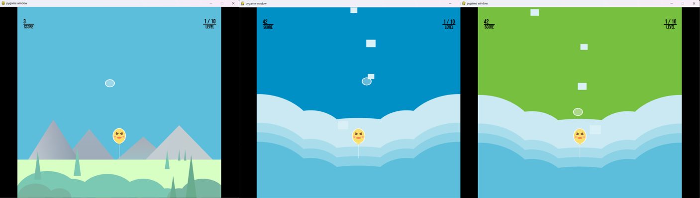

# Rise Up - OpenGL + Pygame Edition 🎈🛡️


<p align="center">
  
</p>

This is a 2D **Rise Up-style game** created using **Python**, **Pygame**, and **OpenGL**.  
The player controls a shield to protect a rising balloon from obstacles and falling objects.

## 🎮 Gameplay Features

- Balloon rises automatically
- Shield controlled by the player to block objects
- Sound effects and background music
- Custom fonts and textures

## 🧠 Technologies Used

- Python
- Pygame
- PyOpenGL

## 🗂️ Folder Contents

- `Rise_UP.py` — Main game script
- `reload.png` — Game texture
- `.mp3 / .wav` — Background music and sound effects
- `.ttf` — Custom font

## ▶️ How to Run

1. Install the required libraries:

```bash
pip install pygame PyOpenGL
```

2. Run the game:

```bash
python Rise_UP.py
```

## 📜 License

This project is for educational purposes. Feel free to modify and use it!
